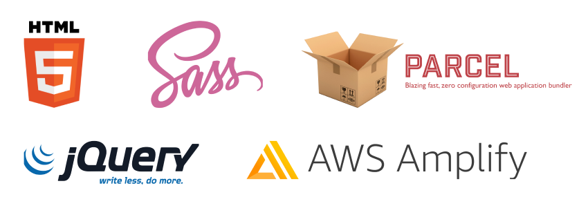

# HCAS

## Project overview

A website for a local charity that provides a holiday cottage to disadvantaged families.

## Features

- Mobile first design
- Built with accessibility in mind (e.g. accessible hamburger menu according to WCAG)
- Improved all metrics in lighthouse report to 100%, including accessibility, SEO, performance, and best practices

## Tech Stack

## User Stories

### Core Stories

As a potential customer, I want to:

- See information about the charity so that I can know more about what is provided
- See pictures of the cottage and surrounding environment
- See ways to donate and support the charity
- See the booking availability of the cottage
- Easily navigate to different sections of your webpage
- Browse your website on mobile, tablet, and desktop
- Visit your website at a secure publicly accessible domain name
  

Additionally, as a visually impaired user or customer with disabilities, I want to:

- Navigate your website using keyboard controls
- Hear my screen reader describe the content on the website
- Learn about disabled access to the cottage

As a trustee of the charity, I want to:
- Update news of the cottage, e.g. covid updates

### Acceptence Criteria

- Accessible menu
- ‘About’ section
- Carousel display of cottage pictures
- Pictures of surrounding environment with links
- Information on disabled access
- Booking availability calendar
- Notification box
- A responsive, mobile-first design
- Ensure the website is accessible to as many different users as possible
